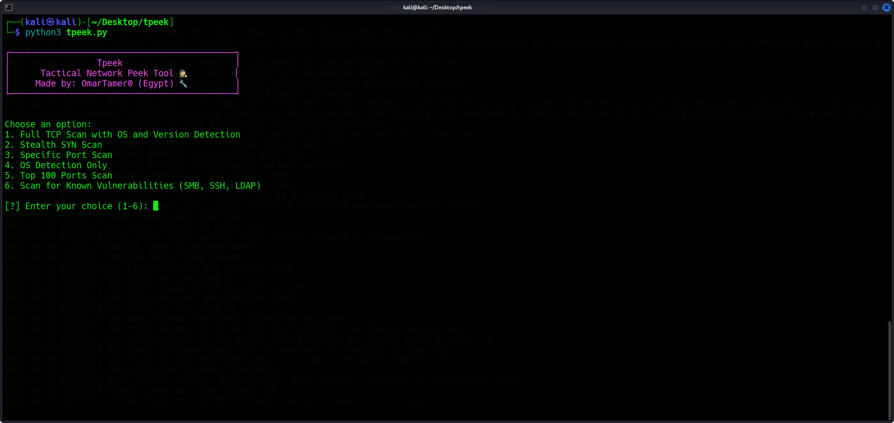
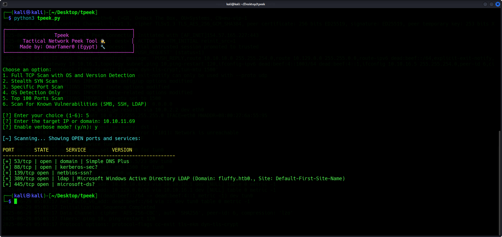
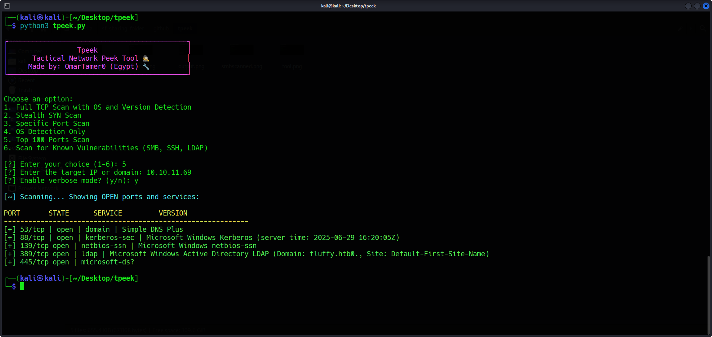

# Tpeek

🕵️ **Tpeek** — Tactical Network Peek Tool  
🔧 Developed by: **OmarTamer0** (Egypt)

---

## 🌟 What is Tpeek?

**Tpeek** is a professional-grade, Python-powered network scanning tool built on top of Nmap.  
It is designed for penetration testers, red teamers, and network admins to quickly identify open ports, detect OS types, and enumerate common services — all with real-time terminal feedback and clean output.

---

## 🧠 Features

- 🔍 **Full TCP Scan** (all ports + version detection)
- 🥷 **Stealth SYN Scan** (`-sS`)
- 🌟 **Specific Port Scan**
- 🧠 **OS Detection**
- 🚀 **Top 100 Ports Scan**
- 🛡️ **Vulnerability Enumeration for SMB, SSH, LDAP**
- 🎨 **Color-coded live output**
- 🗒️ **Saved scan results with timestamps**
- ✨ **Minimalist CLI UI**

---

## ⚙️ Usage

```bash
chmod +x tpeek.py
./tpeek.py
```

You'll see a menu like this:

```
Choose an option:
1. Full TCP Scan with OS and Version Detection
2. Stealth SYN Scan
3. Specific Port Scan
4. OS Detection Only
5. Top 100 Ports Scan
6. Scan for Known Vulnerabilities (SMB, SSH, LDAP)
```

Example:
```bash
# Scan 10.10.10.10 stealthily
./tpeek.py
# Select option 2, enter target IP
```

---

## 📂 Output

All scans are saved under the `scan_results/` folder with filenames like:

```
top_ports_10.10.10.10_2025-05-24_19-30-00.txt
```

---

## 📸 Screenshots

### 🔧 Menu Interface


### ✅ Vulnerability Scan Output


### 📋 Top Ports Example Output


---

## 🧑‍💻 Requirements

- Python 3.6+
- Nmap (must be installed on your system)

Install Nmap:
```bash
sudo apt install nmap
```

---

## 👑 Author

**OmarTamer0**  
🔗 TryHackMe: [https://tryhackme.com/p/OmarTamer0](https://tryhackme.com/p/OmarTamer0)  
🌍 Egypt

---

## 📜 License

MIT License — free to use, fork, and improve.

---

> “Tpeek — Don’t just scan. Peek tactically.” 🔍

